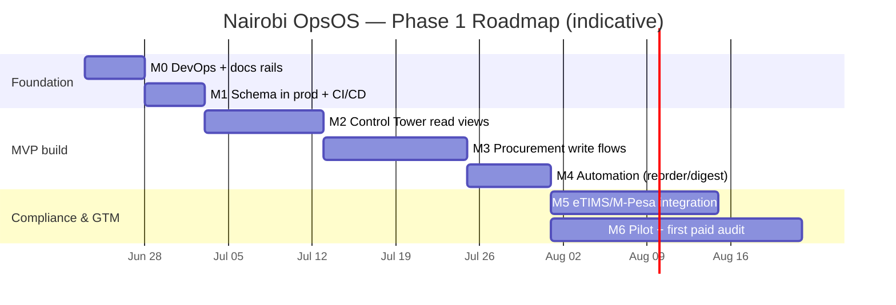

# Project Charter — Nairobi OpsOS

| Field | Value |
|-------|-------|
| **Document** | Project Charter |
| **Version** | 0.2 (Draft for approval) |
| **Date** | 24 June 2026 |
| **Author / PM** | Jay Shah |
| **Sponsor** | Jay Shah (founder) |
| **Status** | Awaiting sign-off to authorise Phase 1 execution |
| **v0.2 change** | Added integration-first guiding principle (build around existing tools, by segment tier). |

---

## 1. Purpose of this document
This charter formally authorises the Nairobi OpsOS project, defines its boundaries,
and establishes the shared understanding against which success is measured. It is
the project's source of authority: scope, objectives, governance, and the
constraints every later document inherits. Nothing in scope here is built without
this being approved; nothing outside it is built without amending this.

## 2. Background & problem statement
Kenyan SMEs and mid-sized organisations run substantial, complex operations —
procurement, stores, distribution, compliance — on a patchwork of WhatsApp,
spreadsheets, paper, and the owner's memory. Growth hits an "admin ceiling": the
business cannot run a day without the founder firefighting, and there is no
single source of operational truth.

The two existing escape routes both fail this market:
- **Heavy ERP** (SAP Business One, Microsoft Dynamics 365 Business Central, Sage
  300, Oracle NetSuite) delivers control but at a cost and complexity most SMEs
  cannot absorb — typically a software floor well into five figures USD per year,
  implementation multiples on top, and 3–6 month rollouts.
- **Manual + point tools** (standalone POS, off-the-shelf accounting, eTIMS Lite)
  are cheap but leave operations fragmented, uncontrolled, and non-auditable.

Simultaneously, **KRA eTIMS** has become mandatory for effectively all businesses,
and from 1 January 2026 KRA's validation engine automatically cross-checks tax
returns against eTIMS invoice data — turning operational record-keeping into a
compliance necessity, not a nice-to-have. This is a forcing function across every
target segment.

**The gap:** there is no lightweight, fast-to-deploy, affordable operational
control layer purpose-built for the Kenyan SME reality (mobile-first, M-Pesa,
eTIMS, intermittent connectivity) and delivered with hands-on consulting rather
than a self-serve licence.

**Guiding design principle — integration-first, not rip-and-replace.** OpsOS builds
*around* the tools a business already uses rather than forcing a switch. Existing
channels (WhatsApp intake, Outlook/email quotes, Excel trackers, QuickBooks finance,
or a segment's vertical system) remain the familiar front door; OpsOS becomes the
clean operational source of truth underneath them. The strength of this posture
varies by segment tier (see `05_Competitive_Landscape_Audit.md` §3 and
`07_Segment_Tooling_Integration_Matrix.md`): in Tier 1 segments OpsOS is the spine;
in Tier 2 it integrates beside an entrenched incumbent. The discipline is to
integrate cleanly, never to *automate the existing chaos* — legacy tools feed and
read from one deduplicated source of truth.

## 3. Vision & mission
**Vision:** Every ambitious Kenyan organisation runs on systems it can afford,
understand, and trust — not on the founder's memory.

**Mission:** Deliver enterprise-grade operational control to Kenyan SMEs through a
consulting-led, AI-automated platform that is an order of magnitude cheaper and
faster to deploy than traditional ERP, starting where the pain and the money are:
procurement, stores, and compliance.

## 4. Strategic objectives & OKRs (first 6 months)
The project is both a **commercial venture** and a **capability showcase** (proof
of Jay's ability to design and ship enterprise-grade systems in the Nairobi
market). Objectives reflect both.

**Objective 1 — Ship a credible, production-grade MVP.**
- KR1: Procurement & Stores Control Tower live on production stack (Supabase +
  PWA + automation) with multi-tenant isolation proven.
- KR2: eTIMS-ready invoice data model and M-Pesa payment capture demonstrated
  end-to-end on a demo tenant.
- KR3: 100% of merges flow through the automated CI/CD + self-updating docs
  pipeline (zero manual deployment, zero stale docs).

**Objective 2 — Convert the MVP into paying engagements.**
- KR1: 5 qualified discovery conversations with target-segment businesses.
- KR2: 2 paid Workflow Audits delivered.
- KR3: 1 signed 14-Day Sprint or Monthly Retainer.

**Objective 3 — Establish a repeatable delivery system.**
- KR1: The offer ladder (Audit → Sprint → Retainer → Full OS Build) documented
  with SOPs and fixed scopes.
- KR2: A reusable module template so segment #2 starts from assets, not zero.

## 5. Scope

### 5.1 In scope (Phase 1)
- One vertical, end-to-end: the **Procurement & Stores Control Tower** for the
  manufacturing / distribution segment.
- Multi-tenant data platform (Supabase/Postgres + RLS) as the source of truth.
- Responsive PWA cockpit (dark, mobile-first) for the control tower.
- Automation layer (n8n) for reorder alerts and scheduled digests.
- eTIMS-ready and M-Pesa-ready data structures (fields, flows) — *integration
  scaffolding and design*, with live API connection sequenced explicitly (see 5.3).
- A first slice of the **ingestion/sync layer** that embodies the integration-first
  principle: WhatsApp intake → structured records, one-time Excel import with
  de-duplication into a clean master, and QuickBooks-compatible export (per
  `07_Segment_Tooling_Integration_Matrix.md`).
- The full DevOps + documentation system (per `DEVOPS_PLAYBOOK.md`).
- Go-to-market collateral for the offer ladder.

### 5.2 Out of scope (Phase 1)
- The other five segments' bespoke modules (NGO, clinical, hospitality, schools,
  professional services) — designed for later, not built now.
- Full general-ledger accounting (we complement, not replace, accounting tools).
- Payroll, HR, CRM beyond what procurement needs.
- Native mobile apps (the PWA covers mobile).
- A self-serve sign-up / billing product (delivery is consulting-led in Phase 1).

### 5.3 Explicitly sequenced (not assumed) — KRA & payments integration
Live eTIMS transmission requires KRA's certified integration path (OSCU/VSCU) and
either self-certification or a certified third-party integrator. Phase 1 builds
the **compliant data model and the invoice/credit-note flows**; the live
certified connection is a defined milestone (M5), not a Phase-1 assumption, and
may be delivered via a certified integrator partner rather than self-certification.
Treating this as sequenced protects the timeline from a dependency we do not fully
control.

## 6. Success criteria
The project is successful when: (a) the MVP runs in production and survives a
real client's procurement cycle on a pilot; (b) at least one paid engagement is
signed; and (c) the build/deploy/document pipeline runs without manual
intervention, demonstrating the operational maturity that is itself the sales
proof.

## 7. Stakeholders & responsibilities (RACI)
This is, in Phase 1, a **solo-founder operation augmented by AI agents**. Rather
than pretend a staffed team, we name the *functions* a big-tech project requires
and who holds each hat. AI (Claude for build/docs, Gemini for runtime) is an
explicit, accountable part of the operating model — but a human approves anything
that writes data, touches money, or ships to a client.

| Function | Held by | R | A | C | I |
|----------|---------|---|---|---|---|
| Sponsor / funding decision | Jay | | ✓ | | |
| Project management | Jay | ✓ | ✓ | | |
| Product (PRD, priorities) | Jay | ✓ | ✓ | AI (drafting) | |
| Engineering (build) | Jay + Claude Code | ✓ | ✓ | | |
| QA / review | Jay + AI reviewers (Claude, Gemini on PRs) | ✓ | ✓ | | |
| Documentation | AI doc-sync (drafts) → Jay (approves) | ✓ | ✓ | | |
| Compliance (eTIMS/data protection) | Jay + certified integrator (M5) | ✓ | ✓ | KRA / partner | |
| Sales & delivery | Jay | ✓ | ✓ | | |
| Pilot client(s) | TBD per engagement | | | ✓ | ✓ |

*R = Responsible, A = Accountable, C = Consulted, I = Informed.*

## 8. Milestones & high-level roadmap
Indicative; refined into sprints in the PRD and on the Kanban board.

| ID | Milestone | Definition of done |
|----|-----------|--------------------|
| M0 | DevOps & docs rails | Repo, CI/CD, Kanban, self-updating docs all live |
| M1 | Schema in production | Validated migrations deployed; multi-tenant RLS proven |
| M2 | Control Tower (read) | Stock-on-hand, reorder alerts, quote comparison views in PWA |
| M3 | Procurement (write) | PR → Quote → LPO → GRN → Invoice → Payment captured in-app |
| M4 | Automation | Reorder-alert and daily-digest flows running in n8n |
| M5 | eTIMS / M-Pesa | Live certified invoice transmission + M-Pesa capture (may use partner) |
| M6 | Pilot & first revenue | One pilot tenant live; ≥1 paid Workflow Audit delivered |

## 9. Assumptions
- Founder can dedicate consistent part-time capacity alongside the HAL role.
- Free tiers (Supabase, Cloudflare, Oracle Cloud, Gemini API) and existing Pro
  plans (Claude, Google) are sufficient for MVP-scale load.
- The eTIMS compliance forcing function continues to drive SME demand.
- A certified eTIMS integrator partnership is obtainable for M5 if
  self-certification proves too heavy for a solo operator.

## 10. Constraints
- **Budget:** near-zero cash; the binding resource is founder time, not money.
- **Hardware:** development on a 2016 MacBook — toolchain must stay lightweight
  (rules out heavy local stacks; favours CLI + cloud build).
- **Team:** one person + AI agents; scope discipline is existential, not optional.
- **Regulatory:** Kenya Data Protection Act (consent, no bought lists) and KRA
  eTIMS certification requirements bound what ships and how.

## 11. High-level risks (summary; full register in Doc 06)
- Scope sprawl / endless scaffolding without shipping (top risk, given history).
- eTIMS certification dependency slipping the compliance promise.
- Solo-founder capacity / bus-factor of one.
- Competitive response from incumbents or modern SME-POS entrants.
- Data protection exposure handling client operational + tax data.

## 12. Governance & cadence
- **Work tracking:** GitHub Projects (Kanban); 1–2 week sprints; WIP-limited.
- **Definition of done:** code merged via PR, checks green, docs auto-synced,
  deployed.
- **Decision log:** consequential decisions captured as ADRs in `/docs/adr`.
- **Review rhythm:** weekly self-review against the OKRs; charter re-reviewed at
  each milestone.
- **Change control:** scope changes are explicit PRs against this charter.

## 13. Approval
| Role | Name | Decision | Date |
|------|------|----------|------|
| Sponsor | Jay Shah | ☐ Approve ☐ Revise | |
