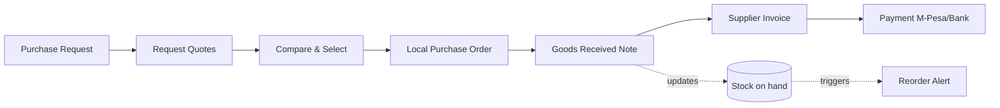

# PRD — Procurement & Stores Control Tower (MVP)

| Field | Value |
|-------|-------|
| **Document** | Product Requirements Document |
| **Product area** | Nairobi OpsOS — Module 1 |
| **Version** | 0.2 (Draft for approval) |
| **Date** | 24 June 2026 |
| **Owner** | Jay Shah (Product) |
| **Status** | Draft for approval |
| **v0.2 change** | Added integration-first framing + ingestion requirements (WhatsApp/Excel/QuickBooks). |

---

## 1. Overview
The Procurement & Stores Control Tower is the first module of Nairobi OpsOS. It
gives a manufacturing or distribution SME a single, real-time view and workflow
for the procure-to-pay and stores cycle: from a purchase request, through
supplier quotes and a local purchase order (LPO), to goods received (GRN),
supplier invoice, and M-Pesa/bank payment — with stock levels and reorder alerts
falling out automatically, and every invoice structured for KRA eTIMS.

We start here because it is where the money, the risk, and the compliance pressure
concentrate for the target segment, and because it produces hard ROI (less
stock-out, less over-ordering, fewer disallowed expenses) that justifies a paid
engagement.

**Integration-first.** The module is designed around the tools the business already
uses, not as a replacement for them. WhatsApp stays the intake channel, Outlook/email
stays where quotes arrive, existing Excel trackers are imported (and de-duplicated)
to seed a clean master, and QuickBooks stays Finance's home. OpsOS becomes the clean
operational source of truth underneath those channels — it removes the manual
re-keying and the duplicate/inaccurate data, not the familiar front door. (Per
`07_Segment_Tooling_Integration_Matrix.md`; for Tier-2 segments the same module
integrates beside a vertical incumbent rather than acting as the spine.)

## 2. Goals & non-goals

### Goals
- Turn WhatsApp/spreadsheet procurement into one auditable workflow — keeping
  WhatsApp as the intake channel, removing the manual re-keying behind it.
- Give owners live stock-on-hand and automatic reorder alerts.
- Make every supplier invoice eTIMS-structured by construction.
- Capture payments (M-Pesa / bank) against invoices for clean reconciliation.
- Prove multi-tenancy and the production stack on a real vertical.

### Non-goals (this release)
- Full general ledger / financial statements (we feed accounting, not replace it).
- Manufacturing BOM / production scheduling.
- Demand forecasting / ML reorder optimisation (simple reorder points only).
- Multi-currency (KES only at MVP).
- Self-serve onboarding (tenants are provisioned during a consulting engagement).

## 3. Target users & personas

| Persona | Role | Goals | Pain today |
|---------|------|-------|-----------|
| **Amina — Operations Owner** | SME founder/MD | Know stock & spend at a glance; stop firefighting | No single view; finds out about stock-outs too late |
| **Kevin — Procurement/Stores Officer** | Raises POs, receives goods | Raise LPOs fast; record receipts accurately | Paper LPOs, manual quote comparison, lost documents |
| **Grace — Finance/Accounts** | Matches invoices & pays | Pay the right supplier the right amount; stay eTIMS-clean | Manual 3-way match; disallowed expenses from bad invoices |
| **Jay — OpsOS operator (internal)** | Configures & supports tenant | Stand up a tenant quickly; support it cheaply | n/a (new) |

## 4. User stories & journeys

Primary flow (the "procure-to-pay" spine):

Representative stories (acceptance criteria abbreviated):
- *As Kevin,* I can raise a Purchase Request with line items so that a need is
  recorded. **AC:** PR persists with org isolation; status = Draft→Submitted.
- *As Kevin,* I can attach multiple supplier quotes to a PR and see them compared
  side by side so I pick the best. **AC:** `v_quote_comparison` shows price/lead
  time per supplier; selection creates an LPO.
- *As Kevin,* I can convert the selected quote to an LPO so the supplier is
  ordered from. **AC:** LPO references quote + PR; immutable once issued.
- *As Kevin,* I can record a GRN against an LPO (full or partial) so receipts are
  tracked. **AC:** GRN writes append-only stock movements; partials supported.
- *As Grace,* I can capture a supplier invoice against an LPO/GRN with eTIMS
  fields so it is compliance-ready. **AC:** invoice carries eTIMS control fields;
  3-way match flag (PO↔GRN↔invoice).
- *As Grace,* I can record an M-Pesa or bank payment against an invoice so it is
  settled and reconciled. **AC:** payment carries M-Pesa reference fields; invoice
  status → Paid/Part-paid.
- *As Amina,* I can open a dashboard and see stock-on-hand, items below reorder
  point, and open POs so I have control at a glance. **AC:** reads from
  `v_stock_on_hand`, `v_reorder_alerts`.
- *As Amina,* I receive a daily reorder digest so I act before stock-outs.
  **AC:** n8n scheduled flow emails/WhatsApps the digest.
- *As Jay (operator),* I can import a client's existing Excel item/supplier trackers
  and have duplicates merged so they start from one clean master. **AC:** import maps
  columns; near-duplicate items/suppliers flagged and merged on confirm.
- *As Kevin,* I can have a WhatsApp request ("need 20MT billets by Friday") become a
  structured draft PR I confirm, so intake stays on WhatsApp but data stops being
  lost. **AC:** parsed draft PR created; requester confirms before it's submitted.
- *As Grace,* I can export matched invoices and payments in a QuickBooks-compatible
  format so I stop re-keying. **AC:** export includes eTIMS fields and LPO/GRN links.

## 5. Functional requirements

| ID | Requirement | Priority |
|----|-------------|----------|
| FR-1 | Multi-tenant orgs with role-based access (owner, officer, finance, viewer) | Must |
| FR-2 | Stock items master (SKU, unit, reorder point, reorder qty) | Must |
| FR-3 | Suppliers master | Must |
| FR-4 | Purchase Requests with line items and status workflow | Must |
| FR-5 | Quotations (multiple per PR) with line pricing & lead time | Must |
| FR-6 | Side-by-side quote comparison | Must |
| FR-7 | Purchase Orders (LPO) generated from a selected quote; immutable when issued | Must |
| FR-8 | Goods Received Notes (full/partial) writing append-only stock movements | Must |
| FR-9 | Supplier invoices with eTIMS-required fields and 3-way match indicator | Must |
| FR-10 | Payments (M-Pesa / bank) against invoices; status roll-up | Must |
| FR-11 | Live views: stock-on-hand, reorder alerts, quote comparison | Must |
| FR-12 | Reorder-alert + daily-digest automation | Should |
| FR-13 | Document/PDF export of LPO and GRN | Should |
| FR-14 | Live eTIMS transmission (OSCU/VSCU, via integrator) | Could (M5) |
| FR-15 | Audit trail on all state changes | Must |
| FR-16 | Excel/CSV import of existing item & supplier trackers, with de-duplication into one clean master | Should |
| FR-17 | WhatsApp intake: turn an inbound message into a structured draft Purchase Request for confirmation | Should |
| FR-18 | QuickBooks-compatible export of invoices/payments (Finance stops re-keying) | Should |
| FR-19 | Email/Outlook quote capture: attach an emailed quote to the right PR | Could |

## 6. Non-functional requirements

| Category | Requirement |
|----------|-------------|
| **Security** | Row-Level Security on every table; org isolation proven; anon key only exposes RLS-protected data; service-role keys server-side only |
| **Privacy** | Kenya Data Protection Act alignment; consent for any messaging; no bought contact lists |
| **Performance** | Cockpit primary views render < 2s on a mid-range Android over mobile data |
| **Availability** | MVP target 99% (free-tier realistic); graceful read-only on backend hiccup |
| **Offline/poor connectivity** | PWA installable; tolerant of flaky connections (read cache); writes queue or fail safe |
| **Auditability** | Append-only stock ledger; immutable issued LPOs; full change history |
| **Maintainability** | Schema is the source of truth; all changes via migrations; self-documenting pipeline |
| **Cost** | Runs within free tiers + existing Pro plans at MVP scale |

## 7. Success metrics
- **Product:** a full procure-to-pay cycle completed in-app on a pilot tenant.
- **Value:** measurable reduction in stock-outs / emergency buys for the pilot
  (baseline captured during the Workflow Audit).
- **Compliance:** 100% of invoices carry valid eTIMS-structured fields.
- **Adoption:** procurement/stores officer uses it for real LPOs within 2 weeks of
  go-live (not reverting to spreadsheets).

## 8. Dependencies
- Validated Supabase schema (already built & tested: orgs, suppliers, stock_items,
  purchase_requests, quotations, purchase_orders, grns, invoices, payments,
  stock_movements; views `v_stock_on_hand`, `v_reorder_alerts`,
  `v_quote_comparison`).
- DevOps + docs pipeline (per `DEVOPS_PLAYBOOK.md`).
- M5 integration: KRA eTIMS certification path; M-Pesa Daraja; (optional)
  Africa's Talking for SMS/USSD; WhatsApp Cloud API for digests.

## 9. Release plan (sprints)
- **Sprint 1 (M2):** read-only Control Tower — dashboards & the three views.
- **Sprint 2 (M3a):** PR → Quote → Compare → LPO write flows.
- **Sprint 3 (M3b):** GRN → Invoice → Payment + stock ledger + audit trail.
- **Sprint 4 (M4):** automation (reorder alert, daily digest), PDF exports.
- **Sprint 5 (M5):** eTIMS/M-Pesa live integration (sequenced; partner-assisted).

## 10. Open questions
- Self-certify eTIMS vs. partner with a certified integrator (TSL / Your Apps /
  Dynamic Mobility) for speed? → decide before M5; leaning partner-first.
- Digest channel priority: WhatsApp vs. SMS vs. email for Kenyan SME owners?
- Minimum viable role model — is 4 roles right, or start with 2 (admin/officer)?

## 11. Out-of-scope backlog (future modules)
NGO grant/programme ops; clinic patient-flow & inventory; hospitality stock &
events; school fees & admin; professional-services delivery. Each becomes its own
PRD when sequenced.
