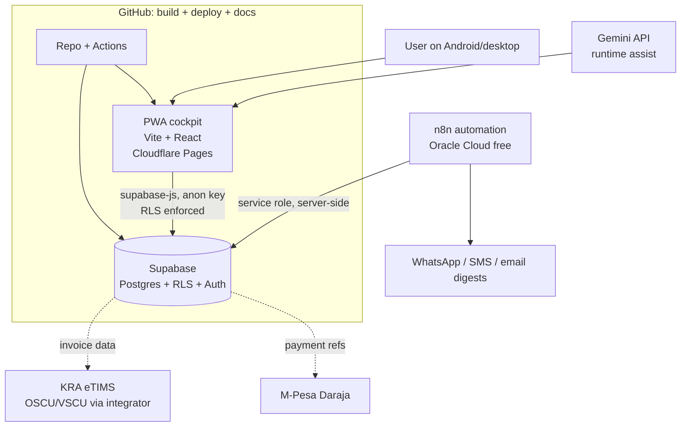
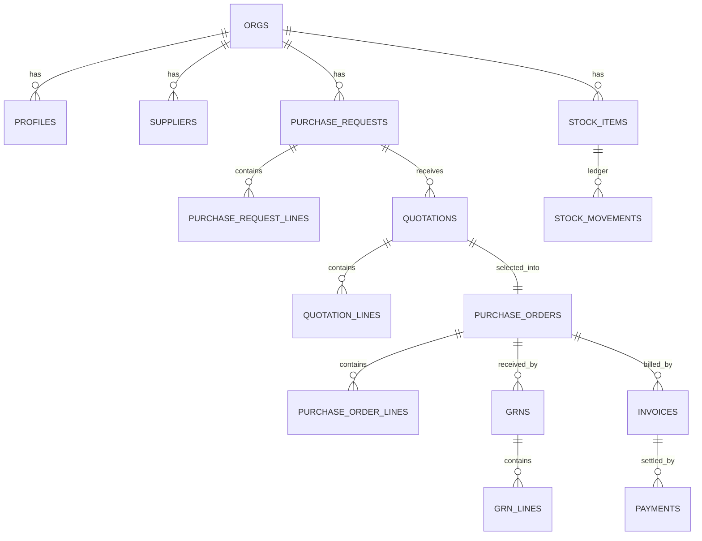

# Technical Design Spec (RFC) — Nairobi OpsOS Platform & Control Tower

| Field | Value |
|-------|-------|
| **Document** | RFC / Technical Design Specification |
| **Version** | 0.3 (Open for comments) |
| **Date** | 24 June 2026 |
| **Author** | Jay Shah (Engineering) |
| **Reviewers** | AI reviewers (Claude, Gemini) on PRs; founder ratifies |
| **Status** | Open for comments → becomes design of record on ratification |
| **v0.3 change** | Reworked §7 ingestion into an adapter-library-over-shared-core model (multi-segment; HAL as reference specimen), calibrated against a real 5,793-row HAL item master. |
| **v0.2 change** | Added §7 Ingestion & sync layer (integration-first architecture); renumbered later sections. |

---

## 1. Context & problem
We need a multi-tenant operational platform that is (a) credible/enterprise-grade
as a showcase, (b) cheap to run on free tiers, (c) buildable by one person + AI on
a 2016 MacBook, and (d) compliant with Kenyan realities (eTIMS, M-Pesa, flaky
connectivity). This RFC defines the architecture and the Control Tower module
design, and records the trade-offs and alternatives considered.

## 2. Goals / non-goals
**Goals:** secure multi-tenancy by construction; schema as single source of truth;
mobile-first PWA; automated CI/CD and self-updating docs; eTIMS/M-Pesa-ready data
model. **Non-goals:** native apps; bespoke infra/k8s; building our own auth;
self-serve billing.

## 3. High-level architecture

**Layers:**
- **Data (source of truth):** Supabase — managed Postgres with Row-Level Security,
  Auth, and auto REST/GraphQL. The database *is* the application's core; business
  invariants live in schema, constraints, RLS, and views.
- **App:** Vite + React PWA, dark mobile-first cockpit, deployed on Cloudflare
  Pages (per-PR preview URLs, production on `main`). Talks to Supabase via
  `supabase-js` with the anon key; RLS does the authorisation.
- **Automation:** n8n self-hosted on Oracle Cloud Always-Free. Holds the
  service-role key server-side; runs scheduled/reactive flows (reorder alerts,
  digests, future eTIMS/M-Pesa orchestration).
- **Runtime AI:** Gemini API free tier for in-product assistance (e.g. natural-
  language queries, summarisation) — never holds secrets client-side.
- **Build loop:** Claude Code + GitHub Actions (see `DEVOPS_PLAYBOOK.md`).

## 4. Data model
Source of truth = `supabase/migrations`. Core entities (multi-tenant via `org_id`,
RLS on every table):

Notable design choices:
- **`stock_movements` is an append-only ledger.** Stock-on-hand is *derived*
  (`v_stock_on_hand`), never stored as a mutable counter — this gives an auditable
  history and avoids drift.
- **Issued LPOs are immutable**; changes are new documents, preserving the audit
  trail.
- **`invoices`** carries KRA/eTIMS control fields (control unit number, QR/code
  placeholders, buyer PIN, tax breakdown) so compliance is structural.
- **`payments`** carries M-Pesa fields (transaction ref, phone, paybill/till) for
  clean reconciliation.
- **Control-tower views:** `v_stock_on_hand`, `v_reorder_alerts`,
  `v_quote_comparison` push logic into the DB so the PWA stays thin.

## 5. Security & multi-tenancy
- **RLS everywhere.** Every table has `org_id` and an org-isolation policy keyed to
  the authenticated user's org (`current_org_id()` helper). No row crosses tenants.
- **Key model.** The PWA only ever uses the **anon** key — safe to ship because RLS
  governs every read/write. The **service-role** key (bypasses RLS) lives only in
  n8n / server contexts, never in the client or git.
- **Auth.** Supabase Auth; roles (owner/officer/finance/viewer) enforced in
  policies and checked in UI.
- **Demo tenant.** The only anon-readable data is a scoped demo org for sales
  demos; production tenants are never anon-readable.
- **Data protection.** Kenya DPA alignment: consent for messaging, no bought
  lists, least-data collection, deletion path.

## 6. API / contract surface
- Supabase auto-generates REST + GraphQL from the schema; the PWA uses
  `supabase-js`. The **schema is the API contract**; we generate TypeScript types
  from it (`supabase gen types`) so the client is type-safe and drift shows up at
  compile time.
- Server-side/automation actions (eTIMS transmission, M-Pesa callbacks, digests)
  are n8n webhooks/flows — documented as an OpenAPI-style reference in
  `/docs` and kept current by doc-sync.

## 7. Ingestion & sync layer (adapter library over a shared core)
This layer is what makes "build around existing tools, don't rip-and-replace"
real — across **all** segments, not one. The design is deliberately *not* one
universal importer and *not* a bespoke importer per client. It is a small **library
of source adapters** sitting over **one shared staging-and-review core**. Each
business already has *some* structure; the engine detects which *shape* it is
looking at and maps it onto the Supabase spine — it adapts to the source rather than
flattening the source into a generic template. HAL is not the target; it is the
**reference specimen** used to calibrate the structured-ledger adapter. Adapter↔
segment mapping lives in `07_Segment_Tooling_Integration_Matrix.md`.

### 7.1 The shared core (built once, used by every adapter)
1. **Column/field mapping**, saved *per client* (one-time cost per tenant, not per
   import). AI (Gemini) proposes the mapping; a human confirms.
2. **Staging / quarantine.** Imported rows land in a staging table, never directly
   in the source of truth.
3. **Validation** against types, controlled vocabularies, and required fields.
4. **Fuzzy de-duplication** with clustering (rules in 7.3).
5. **Human confirm-before-commit.** A review screen presents merges, errors, and
   unmatched values; nothing reaches the spine unconfirmed. *Never automate the chaos.*
6. **Idempotent re-runs** (re-importing the same source doesn't double-create).
7. **Source-key preservation.** The source's own item/code (e.g. HAL's generated
   `I/FA/FRN/OFN/…` code) is stored as an external reference alongside our UUID.
8. **Isolation.** Each adapter runs as an n8n flow / edge function with its own
   credentials (service-role server-side only); a failure can't corrupt the spine.

### 7.2 The adapter library (per shape — reused across segments)

| Adapter | Source shape | Segments it serves |
|---------|--------------|--------------------|
| **Structured-ledger (Excel)** | Templated workbook with item master + IN/OUT/STOCK tabs and code tables (HAL-class) | Manufacturing, distribution, larger NGOs/schools |
| **QuickBooks / accounting export** | GL, classes/funds, invoices, payments | NGOs, SME finance across segments |
| **Vertical-system export** | HMIS / POS / school-ERP extracts (read/complement only) | Clinics, hospitality, schools (Tier 2) |
| **Formless sheet** | Ad-hoc single-sheet, merged cells, no IDs | Micro/SME long tail, all segments |
| **Messaging intake** | WhatsApp / email free text → draft records | All segments (esp. mfg, distribution) |

Adapters are independent: shipping the structured-ledger adapter unblocks several
segments at once; new shapes are added without touching the core.

### 7.3 Structured-ledger adapter — calibrated against a real HAL master
Profiled against a real 5,793-row HAL `ITEM DB` (single clean header row; a
hierarchical taxonomy of Classification → Group → Sub-Group → Sub-Sub-Group, each
with a code; UOM and manufacturer code tables; a generated composite item code).
What the real data taught the adapter:
- **Import the source's controlled vocabularies as reference data.** UOM (11 values),
  Group (4), and the manufacturer list came through clean (0 near-dupes after
  normalisation) — controlled lists are high-confidence and should seed our
  categories/UOM tables, not be re-typed.
- **De-dup is mandatory even on a "clean" master.** That curated, all-valid sheet
  still held **259 exact-duplicate descriptions over 574 rows (~10%)** and 18
  punctuation/spacing near-dupe clusters (`LED BULB 5W (PIN TYPE)` vs `… PIN TYPE`;
  `(GI)` vs `GI`). Normalisation = case-fold + collapse whitespace + neutralise
  punctuation/hyphens.
- **Duplicate description ≠ duplicate item.** Those 574 rows had *zero* duplicate
  generated codes — the same physical item was filed under different category paths.
  The engine therefore compares description *plus classification context* and surfaces
  "same item, different category" as a **taxonomic-inconsistency review case**, never
  an auto-merge.
- **Don't assume completeness; plan to enrich.** Reorder level was 100% blank and 65%
  of items were manufacturer "NOT IDENTIFIABLE". Fields our features need (reorder
  points for alerts, supplier links) often aren't in the source and must be *captured*
  during onboarding, not read.

### 7.4 Other adapters (summaries)
- **Messaging intake (WhatsApp Cloud API).** Inbound message → webhook → Gemini parses
  intent/entities → *draft* Purchase Request → requester confirms. Intake stays on
  WhatsApp; data stops getting lost.
- **QuickBooks export.** Matched invoices/payments (eTIMS fields + LPO/GRN links)
  exported in a QuickBooks-importable shape; file export first, API sync once a client
  is paying.
- **Vertical-system export (Tier 2).** Read-only / complementary hooks into HMIS / POS
  / school-ERP where an API exists — to feed procurement, not replace the incumbent.
  Feasibility per incumbent is an open question (§13).

**HAL is the clean end of the spectrum.** It is templated and disciplined, so it is
the *easiest* real input; the structured-ledger adapter is built to it first, then
hardened outward toward the formless-sheet adapter. If the engine handles both ends,
the middle is covered.

**Data-protection note.** Inbound messaging requires consent (Kenya DPA); no scraped
or bought contact lists enter the system. Client source files are processed under the
engagement, least-data, with a deletion path.

## 8. eTIMS & M-Pesa integration design (M5, sequenced)
- **eTIMS:** KRA exposes system-to-system integration via **OSCU** (always-online)
  and **VSCU** (bulk/intermittent). Given SME connectivity, VSCU-style buffering is
  attractive, but the pragmatic path is **partnering with a KRA-certified
  third-party integrator** (e.g. Total Solutions Ltd, Your Apps Ltd, Dynamic
  Mobility) rather than self-certifying as a solo operator. Phase 1 ships the
  compliant data model and invoice/credit-note flows; the live certified
  connection is M5. Credit notes must be issued from the same solution that issued
  the original invoice — a constraint the model already respects.
- **M-Pesa:** Daraja API for STK push / C2B reconciliation; payment records carry
  the transaction reference. KRA's roadmap to link eTIMS with M-Pesa (PRNs,
  pre-filled returns) makes this pairing strategically valuable.

## 9. Deployment, CI/CD & observability
- **CI on PR:** commit lint, `supabase db start` (migrations apply on a fresh DB =
  breakage caught), `supabase db lint`, AI review.
- **CD on merge:** `supabase db push` (DB), Cloudflare Pages auto-build (app),
  Claude doc-sync (docs), release-please (version/changelog).
- **Environments:** production Supabase project + a second free project as staging;
  Cloudflare per-PR previews act as ephemeral app environments.
- **Observability (MVP-appropriate):** Supabase logs/metrics, Cloudflare analytics,
  n8n execution logs. Heavyweight APM (Datadog/PagerDuty) is deliberately deferred
  until scale justifies cost.
- **Rollout discipline:** small PRs, trunk-based; feature work behind simple flags
  where risky; pilot tenant acts as the canary before wider client rollout.

## 10. Trade-offs & alternatives considered

| Decision | Chosen | Alternatives | Why |
|----------|--------|--------------|-----|
| Backend | Supabase (Postgres + RLS) | Firebase; custom Node API; Google Apps Script (current) | Real SQL, RLS multi-tenancy, free tier, least code to own; Apps Script doesn't scale as a showcase |
| Frontend | Vite + React PWA | Native apps; server-rendered framework | One codebase, installable, mobile-first, cheap to host |
| Hosting | Cloudflare Pages | Vercel; Netlify | Generous free tier, native git previews |
| Automation | n8n (self-host) | Zapier/Make (paid); cloud functions | Owned, free on Oracle Cloud, visual + extensible |
| Runtime AI | Gemini API free tier | OpenAI; local models | Free tier with Search grounding; founder has Google Pro |
| eTIMS | Partner integrator (M5) | Self-certify now | Certification is heavy for a solo operator; de-risks timeline |
| Multi-tenancy | RLS in one DB | DB-per-tenant; schema-per-tenant | Simplest secure model at SME scale; one migration path |
| Integration | Import/export + draft-on-intake first | Full two-way API sync up front | Lower risk/effort; earns deeper sync once a client pays; avoids "automating chaos" |

## 11. Risks (engineering)
- RLS misconfiguration leaking cross-tenant data → mitigated by tenant-isolation
  tests in CI and a "no table without RLS" rule in `CLAUDE.md`.
- eTIMS certification dependency → mitigated by sequencing + partner-first.
- Free-tier limits under real load → monitored; upgrade path costed but deferred.
- Solo bus-factor → mitigated by exhaustive docs-as-code and a reproducible
  pipeline anyone could pick up.
- Connector/ingestion corrupting the source of truth → mitigated by draft-on-intake,
  validation/de-dup before writes, and isolated connector credentials.

## 12. Rollout plan
Build read views → write flows → automation → integration, each behind a PR with
green checks, deployed continuously, validated on the demo tenant, then a single
pilot tenant before any second client.

## 13. Open questions for reviewers
- VSCU vs. OSCU vs. integrator-abstracted for eTIMS — finalise at M5 design.
- Do we generate types in CI and commit them, or generate at build time only?
- Minimum role model for launch (2 vs 4 roles)?
- QuickBooks/Outlook: file import-export in v1 vs. two-way API sync — and which
  Tier-2 incumbents expose usable APIs for the complement play (feasibility).
