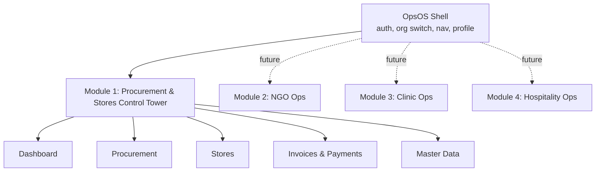
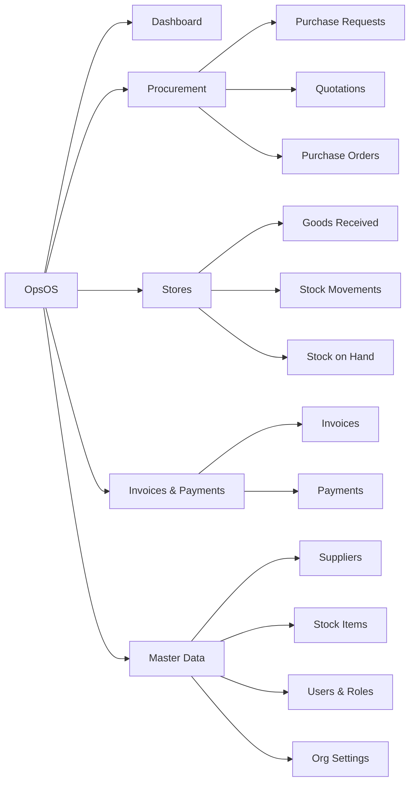
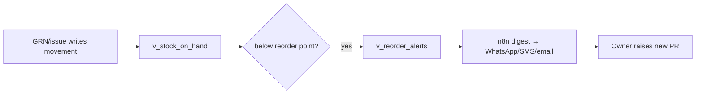

# Information Architecture — Nairobi OpsOS (Control Tower)

| Field | Value |
|-------|-------|
| **Document** | Information Architecture Specification |
| **Version** | 0.1 (Draft) |
| **Date** | 23 June 2026 |
| **Owner** | Jay Shah (Product / Design) |
| **Status** | Draft |

---

## 1. Purpose
This document defines *where everything sits*: the system's structure, the
navigation model, the content/entity model as the user encounters it, the primary
user flows, the screen inventory, the route map, and the role-based access map. It
is the bridge between the PRD (what) and the build (how it's laid out), and the
reference for keeping the product coherent as modules are added.

## 2. System context (zoom level 0)
Nairobi OpsOS is one platform that will host multiple segment modules over time.
The Control Tower (procurement & stores) is Module 1. The IA is designed so future
modules slot into the same shell rather than becoming separate apps.

## 3. Navigation model
Primary navigation is a left rail (collapses to a bottom bar on mobile). Five
top-level destinations for Module 1, plus the shell-level controls.

| Nav item | Contains | Primary persona |
|----------|----------|-----------------|
| **Dashboard** | Stock-on-hand summary, reorder alerts, open POs, spend snapshot | Owner |
| **Procurement** | Purchase Requests, Quotations, Purchase Orders | Procurement officer |
| **Stores** | Goods Received Notes, Stock Movements (ledger), Stock-on-hand | Stores officer |
| **Invoices & Payments** | Supplier invoices, 3-way match, payments/reconciliation | Finance |
| **Master Data** | Suppliers, Stock Items, Org settings, Users & roles | Owner/Admin |

Shell-level (top bar): org switcher (multi-tenant), global search, notifications,
profile/sign-out.

## 4. IA tree (zoom level 1)

## 5. Content / entity model (user-facing)
How the underlying entities (see RFC §4) surface to users:

| Entity | List view shows | Detail view shows | Key actions |
|--------|-----------------|-------------------|-------------|
| Purchase Request | ref, requester, date, status, #lines | line items, linked quotes | submit, request quotes |
| Quotation | supplier, total, lead time, status | line pricing, comparison link | attach, select → LPO |
| Purchase Order (LPO) | ref, supplier, total, status | lines, source quote/PR, GRNs | issue, export PDF, receive |
| Goods Received Note | ref, LPO, date, received-by | lines (qty received), variances | record (full/partial) |
| Invoice | supplier, amount, eTIMS status, match | tax breakdown, eTIMS fields, match flags | capture, mark transmitted |
| Payment | invoice, amount, method, ref | M-Pesa/bank reference | record, reconcile |
| Stock Item | SKU, on-hand, reorder point | movement history, reorder config | edit, set reorder point |
| Supplier | name, PIN, contact | history, quotes, invoices | edit |

## 6. Primary user flows

**Procure-to-pay (happy path):**

**Reorder loop (automated):**

## 7. Screen inventory (MVP)

| # | Screen | Route | Primary data source |
|---|--------|-------|---------------------|
| 1 | Sign in | `/login` | Supabase Auth |
| 2 | Dashboard | `/` | `v_stock_on_hand`, `v_reorder_alerts`, POs |
| 3 | Purchase Requests (list/detail) | `/procurement/requests` | purchase_requests |
| 4 | Quotations + comparison | `/procurement/quotes` | quotations, `v_quote_comparison` |
| 5 | Purchase Orders (list/detail) | `/procurement/orders` | purchase_orders |
| 6 | Goods Received | `/stores/grn` | grns, stock_movements |
| 7 | Stock on Hand | `/stores/stock` | `v_stock_on_hand` |
| 8 | Stock Movements (ledger) | `/stores/movements` | stock_movements |
| 9 | Invoices | `/finance/invoices` | invoices |
| 10 | Payments | `/finance/payments` | payments |
| 11 | Suppliers | `/master/suppliers` | suppliers |
| 12 | Stock Items | `/master/items` | stock_items |
| 13 | Users & Roles | `/master/users` | profiles |
| 14 | Org Settings | `/master/settings` | orgs |

## 8. Route map & deep-linking
Routes are RESTful and shareable. Detail routes use stable IDs
(`/procurement/orders/:id`). The org context comes from the authenticated session
+ org switcher, never from the URL (so links can't leak cross-tenant). Unknown or
unauthorised routes resolve to a safe empty/permission state, not an error dump.

## 9. Role-based access map

| Screen / action | Owner | Procurement | Finance | Viewer |
|-----------------|:-----:|:-----------:|:-------:|:------:|
| Dashboard | ✓ | ✓ | ✓ | ✓ |
| Raise PR / quotes / LPO | ✓ | ✓ | – | – |
| Record GRN | ✓ | ✓ | – | – |
| Capture invoice | ✓ | – | ✓ | – |
| Record payment | ✓ | – | ✓ | – |
| Master data & users | ✓ | – | – | – |
| View everything (read) | ✓ | ✓ | ✓ | ✓ |

Access is enforced in the database (RLS + role checks), not just hidden in the UI.

## 10. Design system notes
Dark "cockpit" aesthetic (near-black canvas, lime/cyan accents), mobile-first,
high-contrast for outdoor/warehouse use, large touch targets, terse labels suited
to fast operational use. Reuses tokens established in the existing prototype so the
look is consistent and recognisable across modules.
