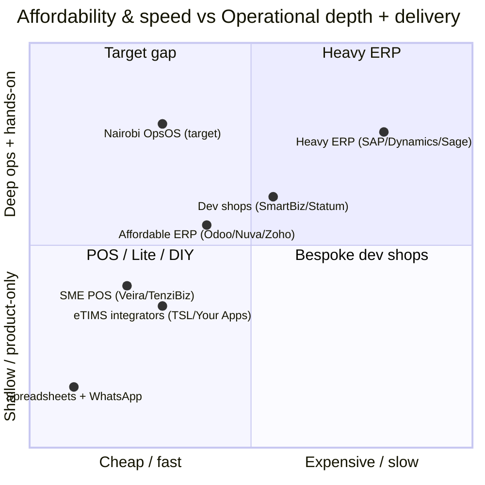

# Competitive Landscape Audit — Nairobi OpsOS (Kenyan Market, 2026)

| Field | Value |
|-------|-------|
| **Document** | Competitive Landscape Audit |
| **Version** | 0.2 (Draft) |
| **Date** | 24 June 2026 |
| **Owner** | Jay Shah (Strategy) |
| **Basis** | Live web research, June 2026, incl. a segment-by-segment tooling scan. Companies named are real market players; assessments are our strategic interpretation, separated from fact below. |
| **v0.2 change** | Added segment tiering (§3): Tier 1 build-the-spine vs. Tier 2 integrate-and-complement, grounded in per-segment incumbent research. See also `07_Segment_Tooling_Integration_Matrix.md`. |

---

## 1. Purpose & method
This audit maps who else solves the operational-control problem for Kenyan SMEs,
where they are strong and weak, and where the defensible gap for Nairobi OpsOS
sits. Following good competitive-intelligence practice, we **separate observable
facts from strategic assumptions** and keep counter-moves realistic for a
solo-founder, near-zero-budget operation.

The market splits into five competitor categories, plus the "do nothing" default.
But the sharpest strategic cut is on the **demand** side, not the supply side: our
target segments fall into two tiers depending on what they already run on (§3).
This determines whether OpsOS can be the operational spine or must integrate
alongside an entrenched vertical system.

## 2. Market context (facts)
- **eTIMS is now a forcing function.** KRA's electronic Tax Invoice Management
  System is mandatory for effectively all businesses, and from 1 January 2026 a
  validation engine automatically cross-checks tax returns against eTIMS invoice
  data; the final compliance window closed 31 March 2026. Non-compliant expenses
  are disallowed automatically. KRA has signalled tighter eTIMS↔M-Pesa linkage
  (PRNs, instant settlement, pre-filled returns).
- **ERP for SMEs is expensive and slow.** Independent sources put SME ERP at a
  software floor commonly around USD 10k+/year with implementation at a 2–5×
  multiple, and 3–6 month rollouts for SMEs.
- **Nairobi is a deep services market** ("Silicon Savannah"): many ERP partners,
  dev shops, and automation consultancies already compete for SME IT spend.

## 3. Segment tiering — the headline finding
The six target segments do **not** share a common tool stack, and they split into
two tiers by what they already run on. This is the single most important strategic
input to scope and sequencing.

### Tier 1 — fragmented, generic-tool segments (OpsOS can be the spine)
These run operations on general-purpose tools (Excel + WhatsApp + QuickBooks/Sage),
exactly like HAL. No dominant operational system owns the procure-to-pay spine, so
OpsOS becomes the clean source of truth *underneath* their existing channels.

- **Manufacturing** — spreadsheets + WhatsApp + QuickBooks/Sage; ERPNext/Odoo as
  the costly upgrade path. The founding wedge; strongest fit.
- **Distribution / FMCG** — paper order books, Excel, M-Pesa; Sales-Force-Automation
  / Distributor-Management systems only at scale. Strong fit (procurement + stock +
  M-Pesa reconciliation, where wallet-level settlement hides individual txns).
- **NGOs** — QuickBooks fund accounting + Excel + donor CRMs; procurement carries
  donor-compliance rules (procurement plans, ToRs, bid analysis) generic tools
  handle badly. Strong fit (grant-aware procurement + donor-ready reporting).

### Tier 2 — mature vertical-SaaS segments (OpsOS integrates / complements, not replaces)
These already have affordable, locally-built, M-Pesa- and eTIMS-integrated software
with hundreds of live deployments. Competing head-on is hard and unwise; the play
is to integrate alongside, or take only the back-office procurement slice these
systems under-serve.

- **Clinics / labs / health** — entrenched HMIS incumbents: **Medicentre** (Hanmak,
  250+ hospitals), **AphiaOne** (Medbook, 200+ facilities, AphiaOne Lite for
  clinics), **Sanitas**, **Ksatria**, plus open-source OpenMRS/DHIS2. Already wired
  to SHA/SHIF, eTIMS, M-Pesa, MOH reporting, insurance (Slade/SMART).
- **Hospitality** — saturated with cheap M-Pesa+eTIMS POS: **SimbaPOS**, **JiPOS**,
  **Uzalynx**, **ModernPOS**, **POSmart** — recipe/ingredient inventory, KDS, ~KES
  1,200/mo. Back-of-house supplier procurement is the only thin slice.
- **Schools** — mature, cheap school-ERP: **Elimikasasa** (free <100 students),
  **EBingwa**, **EliTek**, **SCHULE**, **Cloud School**, with M-Pesa fees, CBC
  grading, parent SMS, and the **NEMIS** government data layer. Only large schools'
  procurement/stores is open.

### What the tiers mean for "build around existing tools"
The phrase changes meaning by tier. In **Tier 1**, the existing tools are generic,
so OpsOS *is* the spine (ingest from WhatsApp/email, dedupe into one master, export
to QuickBooks). In **Tier 2**, the existing tool is a real vertical system, so OpsOS
cannot be the spine — it integrates beside the HMIS/POS/school-ERP or stays out.
Every segment, both tiers, shares the same rails: **M-Pesa, eTIMS, WhatsApp/SMS**.
Full mapping in `07_Segment_Tooling_Integration_Matrix.md`.

### Sequencing implication
Build for Tier 1 in order (**manufacturing → distribution → NGO**); treat Tier 2
(**clinics, hospitality, schools**) as later integrate-and-complement plays, not
replace plays. This is more honest and more winnable than fighting entrenched, cheap
incumbents, and it validates starting with the manufacturing/distribution
Procurement & Stores Control Tower.

## 4. Competitor categories

### Category A — Heavy / mid-market ERP (incumbents)
**Players (facts):** SAP Business One, Microsoft Dynamics 365 Business Central,
Sage 300 / Sage Business Cloud, Oracle NetSuite, SYSPRO — implemented locally by
partners such as **Coretec Africa**, **Software Dynamics Group**, **Impax Business
Solutions** (Microsoft Solutions Partner since 2003), and **Stelden**.

- *Strengths:* deep functionality, full GL, compliance modules, brand trust,
  scalability, established implementer networks.
- *Weaknesses (assumption):* cost and complexity exclude most SMEs; long
  implementations; over-built for a business that just needs procurement under
  control; partner-dependent customisation.
- *Where they create friction:* a distribution SME pays enterprise prices and
  waits months for capability it won't fully use.

### Category B — Affordable / modular ERP
**Players (facts):** Odoo (from ~USD 7.25–10.90/user/mo; free single app),
**ERPmaster / Nuva** (Odoo-based, African-SME focused, from ~USD 50/mo with local
support), Zoho ERP, ERPNext (open source).

- *Strengths:* far cheaper; modular; cloud; local support emerging.
- *Weaknesses (assumption):* still self-serve software, not hands-on
  transformation; configuration burden falls on the SME; generic, not built around
  the Kenyan procurement + eTIMS + M-Pesa + connectivity reality out of the box;
  "module sprawl" can overwhelm a small team.
- *Where they create friction:* the SME buys a licence and is left to make it work.

### Category C — eTIMS integrators & tax-compliance vendors
**Players (facts):** KRA-approved third-party integrators — **Total Solutions
Limited (TSL)** (eTIMS API, Westlands), **Your Apps Limited** (Smart QBD / Xero /
SAP / Zoho add-ons), **Dynamic Mobility** (KRA-approved integrator + TenziBiz POS).
KRA offers two system modes (OSCU online / VSCU bulk-offline) and a free eTIMS Lite
app for micro businesses.

- *Strengths:* certified, compliance-focused, bridge existing accounting to KRA.
- *Weaknesses (assumption):* point solutions — they make invoices compliant but
  don't fix the upstream operational mess (procurement, stores, reorder).
- *Strategic note:* these are **potential partners, not just rivals** — Nairobi
  OpsOS can integrate via a certified integrator rather than self-certify.

### Category D — Modern SME POS / business-management apps
**Players (facts):** **Veira** (AI-powered, offline-first POS + native eTIMS +
inventory + analytics + payment reconciliation, built for Kenyan SMEs),
**TenziBiz POS** (Dynamic Mobility). KRA's **eTIMS Lite** is the free floor.

- *Strengths:* offline-first, mobile, cheap/free, eTIMS-native, fast onboarding —
  genuinely fit for the market; Veira in particular is a credible modern entrant.
- *Weaknesses (assumption):* POS/retail-centric; thinner on B2B procurement,
  multi-supplier quote comparison, LPO/GRN workflows, and the control-tower view a
  manufacturer/distributor needs; product-led, not consulting-led.
- *Where they create friction:* great at the counter, lighter on the back-office
  procurement spine.

### Category E — Consulting-led automation & dev shops (closest model)
**Players (facts):** **SmartBizSystems** (SME automation, WhatsApp Business API,
M-Pesa funnels, SOPs for Nairobi service firms — explicitly frames the "admin
ceiling"), plus custom-software/automation firms (**Statum**, **Scedar
Technologies**, **DRO Digital**, **Absolute Corporate Solutions**, and a long tail
of Nairobi agencies).

- *Strengths:* hands-on, local, founder-relatable messaging, flexible.
- *Weaknesses (assumption):* many skew to marketing/lead-gen automation or bespoke
  one-off builds; fewer offer a *productised, reusable operational platform* with
  an enterprise-grade engineering backbone; quality and durability vary widely.
- *Where they create friction:* projects end as orphaned custom builds rather than
  an evolving owned system.

### Category Z — The real default: "do nothing" (spreadsheets + WhatsApp)
The most common competitor. Free, familiar, and deeply entrenched — but it *is* the
admin ceiling. eTIMS enforcement is what finally makes "do nothing" expensive.

## 5. Positioning map (assumption-based)
Two axes that matter to the target buyer: **affordability/speed-to-value** vs.
**operational depth (procurement-to-pay + compliance + consulting)**.

The white space: **deep operational control + consulting delivery, at
affordable/fast price points.** Heavy ERP owns depth but not affordability; POS/Lite
own affordability but not depth; dev shops do hands-on but rarely a durable
productised platform.

## 6. Market gaps Nairobi OpsOS can own
1. **Procurement-to-pay control for SMEs** — the B2B spine (PR→Quote→LPO→GRN→
   Invoice→Payment with reorder intelligence) that POS apps under-serve and ERP
   over-charges for.
2. **Compliance as a byproduct, not a bolt-on** — eTIMS/M-Pesa structured into
   operations, partnered with a certified integrator for the last mile.
3. **Consulting-led, but productised** — the hands-on delivery dev shops offer,
   delivered on a reusable, enterprise-grade platform that keeps evolving (vs.
   orphaned one-off builds).
4. **Built for the Kenyan reality** — mobile-first, offline-tolerant, M-Pesa-native,
   priced for SMEs.
5. **Tiered multi-segment roadmap** — the same control-tower pattern is the *spine*
   for Tier 1 (manufacturing, distribution, NGO) and an *integration/complement*
   for Tier 2 (clinics, hospitality, schools), where vertical incumbents already
   own the core.

## 7. Recommended counter-moves (realistic for a solo operator)
- **Don't compete on price alone; compete on de-risked outcomes.** Lead with the
  Workflow Audit that quantifies stock-outs / disallowed-expense exposure, then the
  14-Day Sprint that fixes the highest-ROI slice. (Mirrors how the strongest local
  players sell transformation, not licences.)
- **Partner, don't rebuild, on eTIMS.** Integrate via a certified integrator (TSL /
  Your Apps / Dynamic Mobility) to get compliance credibility without the
  certification burden.
- **Win on the procurement spine**, the gap POS/Lite apps leave open, rather than
  fighting Veira et al. at the retail counter.
- **In Tier 2, integrate — don't attack.** For clinics, hospitality and schools,
  position OpsOS as a procurement/stores layer beside the incumbent HMIS/POS/
  school-ERP (or sit out), never as a replacement. Head-on competition with
  entrenched, cheap, compliance-wired incumbents is a losing fight.
- **Make the engineering backbone the proof.** The self-updating, fully-automated
  pipeline (per `DEVOPS_PLAYBOOK.md`) is a visible differentiator vs. one-off dev
  shops — it shows durability and seriousness.
- **Productise the offer ladder** so each engagement compounds into reusable
  assets, lowering the cost of the next sale.

## 8. Watch list
- **Veira** and other AI-first SME platforms moving up from POS into procurement.
- KRA's eTIMS↔M-Pesa roadmap — could commoditise compliance (raises the bar; we
  must own the *operational* value above compliance).
- Odoo/Nuva local partners pushing further down-market with managed offerings.

## 9. Fact vs. assumption ledger
- **Facts:** company existence, categories, eTIMS rules/dates, ERP cost/timeline
  ranges, Odoo pricing, KRA OSCU/VSCU modes, and the per-segment incumbents and
  their integrations (HMIS↔SHIF/eTIMS, POS↔M-Pesa, school-ERP↔NEMIS) — all from
  June 2026 web research.
- **Assumptions (our interpretation):** each competitor's specific weaknesses, the
  tier boundaries' commercial implications, positioning coordinates, and the
  size/defensibility of the gap. These should be validated through real discovery
  conversations during the first Workflow Audits.
