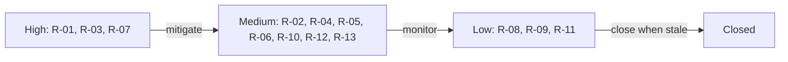

# Risk Register — Nairobi OpsOS

| Field | Value |
|-------|-------|
| **Document** | Risk Register (living document) |
| **Version** | 0.2 |
| **Date** | 24 June 2026 |
| **Owner** | Jay Shah (PM) |
| **Review cadence** | At every milestone, and whenever a risk's status changes |

---

## 1. How to read this
Each risk is scored **Likelihood (1–5) × Impact (1–5) = Score (1–25)**. Score
bands: **1–6 Low**, **8–12 Medium**, **15–25 High**. "Owner" is the function
accountable for the mitigation; in this solo operation that is the founder unless a
partner is named. Risks are reviewed and re-scored at each milestone.

## 2. Register

| ID | Category | Risk | L | I | Score | Band | Mitigation | Trigger / early warning | Owner |
|----|----------|------|---|---|-------|------|------------|--------------------------|-------|
| R-01 | Delivery | **Scope sprawl / endless scaffolding without shipping** (history of this) | 4 | 5 | 20 | High | Charter scope discipline; WIP-limited Kanban; "ship one vertical end-to-end" rule; ruthless out-of-scope backlog | Backlog growing faster than Done; >3 items In Progress; weeks with no deploy | Jay |
| R-02 | Compliance | **eTIMS certification dependency slips**, breaking the compliance promise | 3 | 4 | 12 | Med | Sequence as M5, not an assumption; partner with certified integrator (TSL/Your Apps/Dynamic Mobility) rather than self-certify | M5 design reveals self-cert effort too high; integrator talks stall | Jay + partner |
| R-03 | Capacity | **Solo-founder bandwidth** (HAL role + this); bus-factor of one | 4 | 4 | 16 | High | Realistic part-time roadmap; AI augmentation; exhaustive docs-as-code so work is resumable; automate everything automatable | Milestones slipping >1 sprint; rising context-switch cost | Jay |
| R-04 | Security | **RLS misconfiguration leaks cross-tenant data** | 2 | 5 | 10 | Med | "No table without RLS" rule in CLAUDE.md; tenant-isolation tests in CI; anon-key-only client; service-role server-side only | CI isolation test fails; any anon read returns another org's row | Jay |
| R-05 | Privacy | **Kenya Data Protection Act breach** (client ops + tax data) | 2 | 5 | 10 | Med | DPA-aligned design; consent for messaging; no bought lists; least-data; deletion path; legal review before handling real client data | Handling first real PII without a consent/DPA basis in place | Jay |
| R-06 | Market | **Competitive response** — Veira-type SME platforms add procurement; KRA commoditises compliance | 3 | 3 | 9 | Med | Win on procurement spine + consulting depth, not compliance alone; productise offer ladder; move fast on pilot | Competitor ships procurement-to-pay; KRA bundles more for free | Jay |
| R-07 | Commercial | **No paying client converts** within the window | 3 | 5 | 15 | High | Audit-first low-friction entry; quantify ROI in discovery; pipeline of 5 conversations before building GTM assumptions | <5 discovery convos by M4; audits not converting to sprints | Jay |
| R-08 | Technical | **Free-tier limits hit under real load** | 2 | 3 | 6 | Low | Monitor Supabase/Cloudflare/n8n usage; costed upgrade path documented; defer paid tiers until a paying client justifies them | Approaching free-tier quotas; latency rising | Jay |
| R-09 | Dependency | **Tooling change breaks the pipeline** (e.g. an API/CLI deprecation) | 2 | 3 | 6 | Low | Pin versions; nightly drift sweep catches doc/config rot; trunk-based small PRs make breakage easy to isolate | CI failures after a dependency bump | Jay |
| R-10 | Reputational | **A pilot goes wrong publicly** (this is also a showcase) | 2 | 4 | 8 | Med | Pilot as canary; conservative promises; strong rollback; one tenant before scaling | Pilot data/UX issues surfacing in front of the client | Jay |
| R-11 | Financial | **Hidden costs erode the near-zero-budget assumption** | 2 | 3 | 6 | Low | Track every paid dependency; prefer free/owned tools; flag any new cost before adopting | A workflow quietly starts incurring metered charges | Jay |
| R-12 | Strategic | **Building the perfect pipeline becomes the project** (gold-plating the rails) | 3 | 4 | 12 | Med | Time-box DevOps setup; push one trivial change through the loop to prove it; then return to feature work immediately | Days spent tuning CI with no feature progress | Jay |
| R-13 | Delivery / Data | **Source-data onboarding is the real cost driver** — every client's tracker carries duplicates, taxonomic inconsistency (same item filed under different categories), missing fields and broken references; underestimating it blows delivery timelines, and a careless merge corrupts the source of truth | 4 | 3 | 12 | Med | Profile-first method (`08_Segment_Onboarding_Playbook.md` + `profile_source.py`) on a real file *before* quoting; staging → validate → de-dup → **human confirm-before-commit**; never auto-merge (duplicate description ≠ duplicate item); price onboarding into the Workflow Audit so the effort is billable, not absorbed | Onboarding running well over the scoped audit time; post-commit merge corrections; client data not converging to one clean master | Jay |

## 3. Top risks (for management attention)
1. **R-01 Scope sprawl (20)** — the existential one; discipline is the mitigation.
2. **R-03 Solo capacity (16)** — pace the roadmap honestly; lean on automation.
3. **R-07 No conversion (15)** — sell outcomes early, don't build GTM on hope.

## 4. Risk burndown view

## 5. Review log
| Date | Change | By |
|------|--------|----|
| 2026-06-23 | Register created (v0.1) | Jay |
| 2026-06-24 | Added R-13 (source-data onboarding as cost driver), from profiling a real HAL item master (v0.2) | Jay |
