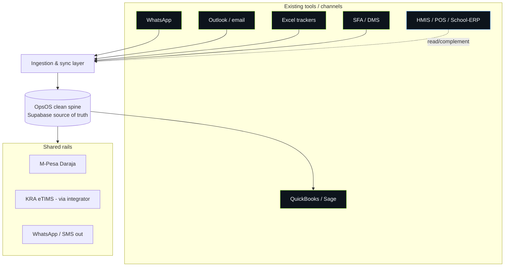

# Segment Tooling & Integration Matrix — Nairobi OpsOS

| Field | Value |
|-------|-------|
| **Document** | Segment Tooling & Integration Matrix (reference) |
| **Version** | 0.2 |
| **Date** | 24 June 2026 |
| **Owner** | Jay Shah (Strategy / Product) |
| **Basis** | June 2026 segment tooling research + profiling of a real 5,793-row HAL item master. Companies named are real; adapter/connector design is our strategic interpretation. |
| **Related** | `05_Competitive_Landscape_Audit.md` (§3 tiering), `03_Technical_Design_RFC.md` (§7 adapter library) |
| **v0.2 change** | Added the adapter-library model (§4A): per-shape source adapters mapped to segments; HAL is the structured-ledger specimen, not a target. |

---

## 1. Why this document exists
Nairobi OpsOS's core strategy is **build around the tools a business already uses —
don't rip and replace.** That only works if we know, per segment, what those tools
actually are. HAL's stack (Excel + WhatsApp + Outlook + QuickBooks) is one
*industrial* instance, not a universal template. This matrix is the source of truth
for what each target segment runs on and how OpsOS connects to it.

## 2. The two-tier reality (summary)
- **Tier 1 — generic-tool segments** (manufacturing, distribution/FMCG, NGOs): run
  on Excel/WhatsApp/QuickBooks. No dominant operational system → **OpsOS is the
  spine**, sitting underneath the existing channels.
- **Tier 2 — vertical-SaaS segments** (clinics, hospitality, schools): already run
  mature, cheap, locally-built, M-Pesa/eTIMS-integrated systems → **OpsOS
  integrates or complements**, never replaces.

## 3. The shared integration core (all segments)
Three rails appear in every segment. Build these once; reuse everywhere.

| Rail | What it is | OpsOS use |
|------|-----------|-----------|
| **M-Pesa (Daraja API)** | Dominant payment method nationwide | Capture/match payments; STK push; C2B/B2B reconciliation |
| **KRA eTIMS** | Mandatory e-invoicing; returns cross-validated since Jan 2026 | Structure invoices/credit notes; transmit via certified integrator |
| **WhatsApp / SMS** | Default business comms (WhatsApp Cloud API; SMS via Africa's Talking) | Intake (turn messages into records); alerts, digests, reminders |

## 4. The matrix

| Segment | Tier | What they run on now | Operational spine | OpsOS role | Key connectors (beyond shared core) |
|---------|------|----------------------|-------------------|------------|--------------------------------------|
| **Manufacturing / industrial** | 1 | Excel trackers, WhatsApp, Outlook, QuickBooks/Sage; some ERPNext/Odoo | Procure → stores → production | **Spine** | QuickBooks/Sage export; Excel import; email (Outlook/Graph) quote capture |
| **Distribution / FMCG / wholesale** | 1 | Paper order books, Excel, M-Pesa; SFA/DMS (FieldAssist, BeatRoute) at scale | Route-to-market: order → deliver → collect | **Spine** | M-Pesa reconciliation (wallet→txn); optional SFA/DMS sync; QuickBooks |
| **NGOs / donor / advocacy** | 1 | QuickBooks (fund accounting), Excel budgets, donor CRMs (DonorPerfect/Kindful); Serenic/Xero at scale | Grant → procure → report to donor | **Spine** | QuickBooks (class/fund tracking); Excel donor-report export; grant/ToR templates |
| **Clinics / labs / dental / wellness** | 2 | HMIS: Medicentre, AphiaOne, Sanitas, Ksatria; OpenMRS/DHIS2 | Patient → billing → SHIF claim | **Integrate / complement** | Read/write to HMIS where API exists; pharmacy/stores procurement slice; SHIF-aware |
| **Hospitality / restaurants / events** | 2 | POS: SimbaPOS, JiPOS, Uzalynx, ModernPOS, POSmart | Order → kitchen → pay → stock | **Complement (back-office only)** | Supplier procurement beside POS; recipe→stock feed; POS export ingest |
| **Schools / professional services** | 2 | School-ERP: Elimikasasa, EBingwa, EliTek, SCHULE, Cloud School; **NEMIS** govt layer | Fees → grading → parent comms | **Complement (large-school procurement only)** | Procurement/stores beside school-ERP; NEMIS-aware exports |

## 4A. Adapter library (the multi-segment ingestion model)
"Build around existing tools" is implemented as a **library of source adapters over
one shared staging-and-review core** — *not* one universal importer, *not* a bespoke
build per client. The engine detects the *shape* of a source and maps it to the spine,
adapting to the source rather than flattening it. Adapters are reused across segments,
which is what keeps a solo operation viable. (Technical design: `03_Technical_Design_RFC.md` §7.)

| Adapter (by source shape) | Recognises | Reused across segments | Build priority |
|---------------------------|-----------|------------------------|----------------|
| **Structured-ledger (Excel)** | Templated workbook: item master + IN/OUT/STOCK tabs + code tables (HAL-class) | Manufacturing, distribution, larger NGOs/schools | P1 (first; HAL specimen) |
| **QuickBooks / accounting export** | GL, classes/funds, invoices, payments | NGOs, SME finance everywhere | P1 |
| **Messaging intake** | WhatsApp / email free text → draft records | All (esp. mfg, distribution) | P1 |
| **Formless sheet** | Ad-hoc single sheet, merged cells, no IDs | Micro/SME long tail, all segments | P2 |
| **Vertical-system export** | HMIS / POS / school-ERP extracts (read/complement) | Clinics, hospitality, schools (Tier 2) | P4 |

The shared core (mapping saved per client → staging/quarantine → validation → fuzzy
de-dup → human confirm-before-commit → idempotent, source-key-preserving) is built
once; new source shapes are added as adapters without touching it.

**HAL is the structured-ledger *specimen*, not a target.** Profiling a real 5,793-row
HAL item master calibrated this adapter and surfaced rules that generalise to any
structured source: import the source's own controlled vocabularies (UOM/group/
manufacturer code tables) as reference data; de-dup even "clean" masters (that one had
~10% exact-duplicate descriptions and punctuation/spacing near-dupes); treat *duplicate
description ≠ duplicate item* (same item filed under different category paths →
surface as a taxonomic-inconsistency review, never auto-merge); and never assume
completeness (reorder level was 100% blank, manufacturer 65% "not identifiable" →
fields our features need must be captured during onboarding, not read).

## 5. Segment detail & integration approach

### Tier 1 — build the spine

**Manufacturing.** Closest to HAL. Procurement initiated on WhatsApp, quotes in
Outlook, LPOs/invoices hand-keyed into departmental Excel, reconciled to QuickBooks
by Finance — producing duplicate items and data errors. *Integration approach:*
WhatsApp → structured PR; Outlook → attached quotes; one-time Excel import with
de-duplication into a clean item/supplier master; eTIMS-structured invoices;
QuickBooks export so Finance stops re-keying.

**Distribution / FMCG.** Spine is route-to-market, not the factory. Reps take orders
(often on paper), deliver, and collect via M-Pesa — but wallet-level settlement
hides individual transactions, breaking reconciliation. *Integration approach:*
order intake + stock + M-Pesa transaction-level reconciliation as the wedge; sync
to an existing SFA/DMS only where one exists; QuickBooks export.

**NGOs.** Spine is fund accounting + donor compliance. QuickBooks carries
restricted/unrestricted funds and grant/program class tracking; budgets and M&E
live in Excel; procurement must follow donor rules (procurement plans, ToRs, bid
analysis). *Integration approach:* grant-aware procurement (every PO tagged to a
fund/grant), donor-ready exports, QuickBooks class sync. This is genuinely
under-served and a strong differentiator.

### Tier 2 — integrate / complement (don't replace)

**Clinics / labs.** Most regulated, most digitised. Incumbent HMIS platforms already
own patient→billing→claims and are wired to SHA/SHIF, eTIMS, M-Pesa, MOH reporting
and insurance (Slade/SMART). *Integration approach:* only enter where (a) a small
clinic/lab/dental/wellness practice has **no** HMIS, or (b) an existing HMIS
under-serves **procurement/pharmacy-stores** and exposes an API to feed. Never pitch
as an HMIS replacement.

**Hospitality.** Saturated with cheap, M-Pesa- and eTIMS-ready POS that already do
recipe/ingredient inventory and supplier basics. *Integration approach:* limit to
back-of-house **supplier procurement and multi-outlet sourcing** beside the POS;
ingest POS exports for consumption data. Thin slice — low priority.

**Schools.** Mature, cheap school-ERP plus the **NEMIS** government layer own
fees/grading/comms. *Integration approach:* only **procurement & stores for larger
schools/groups** (kitchen, boarding, labs, maintenance) beside the school-ERP;
respect NEMIS as the enrolment source of truth. Low priority.

## 6. Integration architecture

## 7. Connector build priority
Order reflects the Tier-1-first sequencing and reuse value.

| Priority | Connector | Serves | Notes |
|----------|-----------|--------|-------|
| P0 | M-Pesa (Daraja) | all | shared rail; reconciliation core |
| P0 | eTIMS (via certified integrator) | all | partner-first; sequenced as charter M5 |
| P0 | WhatsApp/SMS in+out | all (esp. mfg, distribution) | intake + alerts |
| P1 | Excel import + dedup | mfg, distribution, NGO | one-time clean-master migration |
| P1 | QuickBooks export/sync | mfg, NGO, distribution | kills Finance re-keying |
| P2 | Email/Outlook (Graph) quote capture | mfg, NGO | quotes → attached records |
| P3 | SFA/DMS sync | distribution at scale | only where one exists |
| P4 | HMIS / POS / school-ERP read hooks | Tier 2 | complement-only; API-dependent |

## 8. Open questions
- Depth of QuickBooks and Outlook integration in v1: two-way API sync vs. start with
  structured import/export and earn deeper integration once a client is paying.
- Which Tier-2 incumbents expose usable APIs for the complement play (to validate
  feasibility before promising it).
- WhatsApp Cloud API vs. SMS (Africa's Talking) priority for intake by segment.
